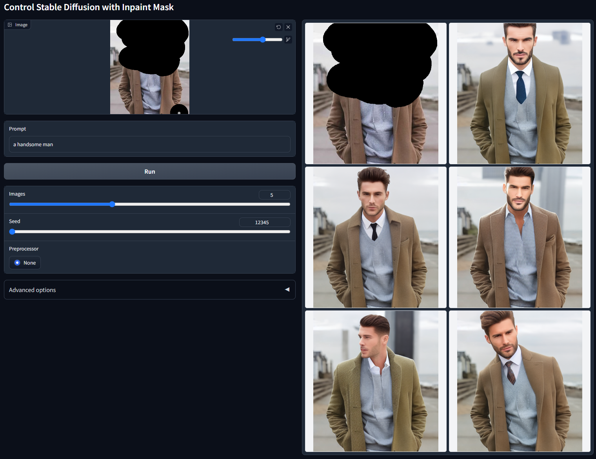
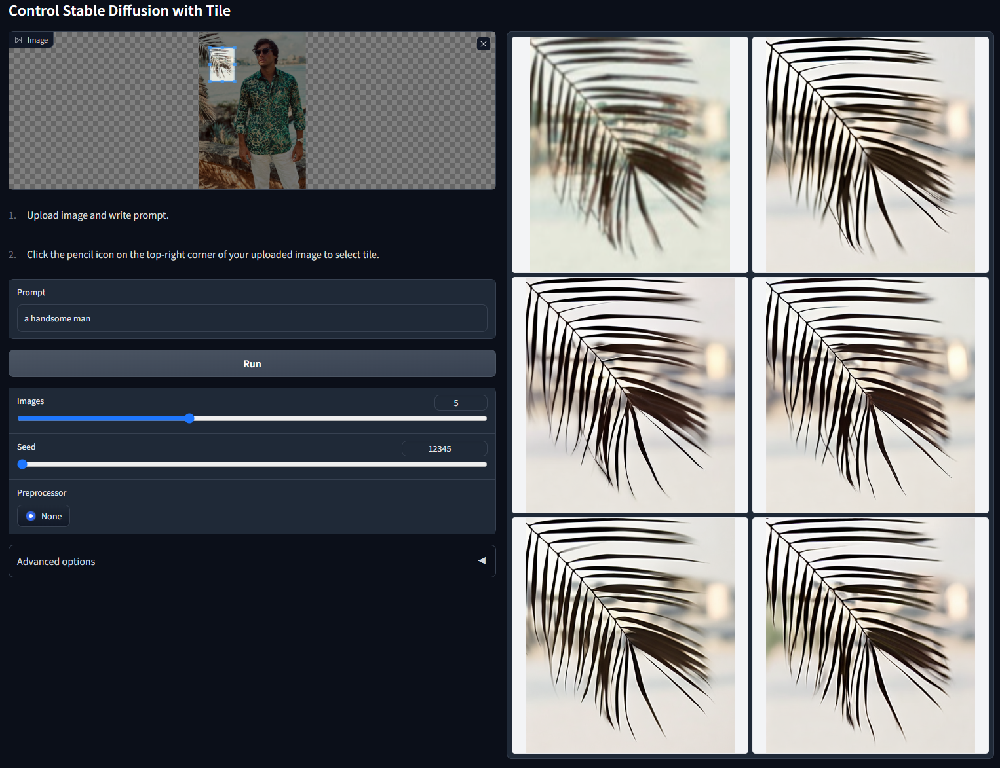
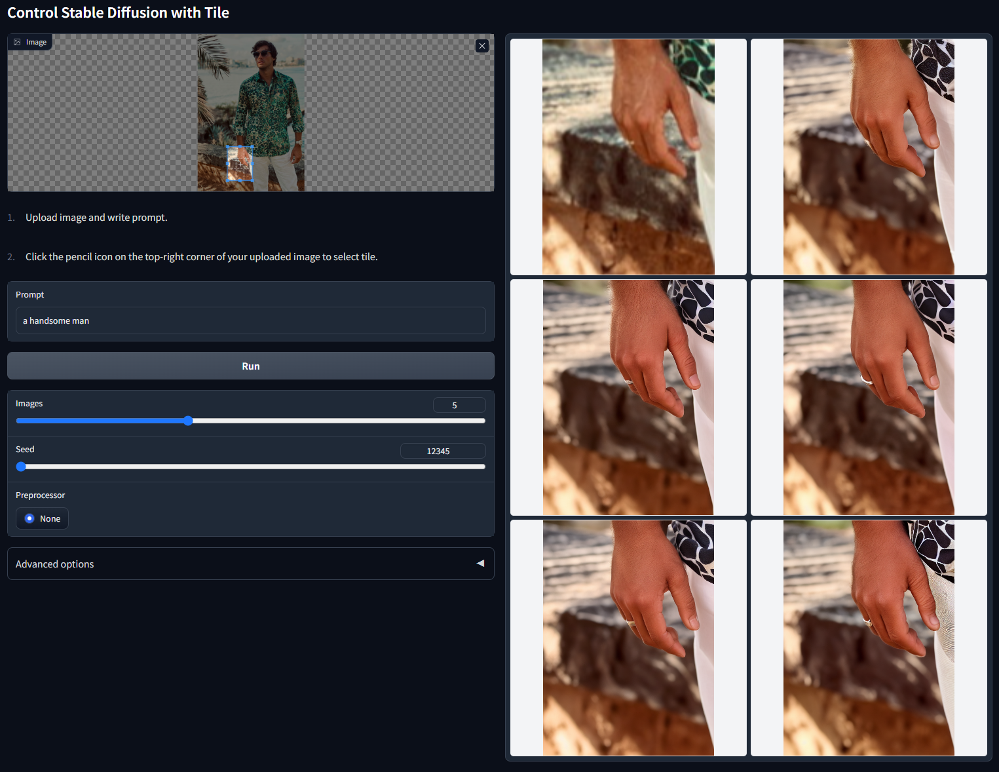

# ControlNet 1.1

This is the official release of ControlNet 1.1.

ControlNet 1.1 has the exactly same architecture with ControlNet 1.0. 

We promise that we will not change the neural network architecture before ControlNet 1.5 (at least, and hopefully we will never change the network architecture). Perhaps this is the best news in ControlNet 1.1.

ControlNet 1.1 includes all previous models with improved robustness and result quality. Several new models are added.

Note that we are still working on [updating this to A1111](https://github.com/Mikubill/sd-webui-controlnet/issues/736). We do not recommend to directly copy the models to the webui plugin before all updates are finished.

This repo will be merged to [ControlNet](https://github.com/lllyasviel/ControlNet) after we make sure that everything is OK.

# Model Specification

Starting from ControlNet 1.1, we begin to use the Standard ControlNet Naming Rules (SCNNRs) to name all models. We hope that this naming rule can improve the user experience.

ControlNet 1.1 include 14 models (11 production-ready models, 2 experimental models, and 1 unfinished model):

    control_v11p_sd15_canny
    control_v11p_sd15_mlsd
    control_v11p_sd15_depth
    control_v11p_sd15_normalbae
    control_v11p_sd15_seg
    control_v11p_sd15_inpaint
    control_v11p_sd15_lineart
    control_v11p_sd15s2_lineart_anime
    control_v11p_sd15_openpose
    control_v11p_sd15_scribble
    control_v11p_sd15_softedge
    control_v11e_sd15_shuffle
    control_v11e_sd15_ip2p
    control_v11u_sd15_tile

You can download all those models from our [HuggingFace Model Page](https://huggingface.co/lllyasviel/ControlNet-v1-1/tree/main). All these models should be put in the folder "models".

You need to download Stable Diffusion 1.5 model ["v1-5-pruned.ckpt"](https://huggingface.co/runwayml/stable-diffusion-v1-5/tree/main) and put it in the folder "models".

Our python codes will automatically download other annotator models like HED and OpenPose. Nevertheless, if you want to manually download these, you can download all other annotator models from [here](https://huggingface.co/lllyasviel/Annotators/tree/main). All these models should be put in folder "annotator/ckpts". 

To install:

    conda env create -f environment.yaml
    conda activate control-v11

## ControlNet 1.1 Depth

Control Stable Diffusion with Depth Maps.

Model file: control_v11p_sd15_depth.pth

Config file: control_v11p_sd15_depth.yaml

Training data: Midas depth (resolution 256/384/512) + Leres Depth (resolution 256/384/512) + Zoe Depth (resolution 256/384/512). Multiple depth map generator at multiple resolution as data augmentation.

Acceptable Preprocessors: Depth_Midas, Depth_Leres, Depth_Zoe. This model is highly robust and can work on real depth map from rendering engines.

    python gradio_depth.py

Non-cherry-picked batch test with random seed 12345 ("a handsome man"):

## ControlNet 1.1 Normal

Control Stable Diffusion with Normal Maps.

Model file: control_v11p_sd15_normalbae.pth

Config file: control_v11p_sd15_normalbae.yaml

Training data: [Bae's](https://github.com/baegwangbin/surface_normal_uncertainty) normalmap estimation method.

Acceptable Preprocessors: Normal BAE. This model can accept normal maps from rendering engines as long as the normal map follows [ScanNet's](http://www.scan-net.org/) protocol. That is to say, the color of your normal map should look like [the second column of this image](https://raw.githubusercontent.com/baegwangbin/surface_normal_uncertainty/main/figs/readme_scannet.png).

Note that this method is much more reasonable than the normal-from-midas method in ControlNet 1.1. The previous method will be abandoned.

    python gradio_normalbae.py

Non-cherry-picked batch test with random seed 12345 ("a man made of flowers"):

Non-cherry-picked batch test with random seed 12345 ("room"):

## ControlNet 1.1 Canny

Control Stable Diffusion with Canny Maps.

Model file: control_v11p_sd15_canny.pth

Config file: control_v11p_sd15_canny.yaml

Training data: Canny with random thresholds.

Acceptable Preprocessors: Canny.

We fixed several problems in previous training datasets. The model is resumed from ControlNet 1.0 and trained with 200 GPU hours of A100 80G.

    python gradio_canny.py

Non-cherry-picked batch test with random seed 12345 ("dog in a room"):

## ControlNet 1.1 MLSD

Control Stable Diffusion with M-LSD straight lines.

Model file: control_v11p_sd15_mlsd.pth

Config file: control_v11p_sd15_mlsd.yaml

Training data: M-LSD Lines.

Acceptable Preprocessors: MLSD.

We fixed several problems in previous training datasets. The model is resumed from ControlNet 1.0 and trained with 200 GPU hours of A100 80G.

    python gradio_mlsd.py

Non-cherry-picked batch test with random seed 12345 ("room"):

## ControlNet 1.1 Scribble

Control Stable Diffusion with Scribbles.

Model file: control_v11p_sd15_scribble.pth

Config file: control_v11p_sd15_scribble.yaml

Training data: Synthesized scribbles.

Acceptable Preprocessors: Synthesized scribbles (Scribble_HED, Scribble_PIDI, etc.) or hand-drawn scribbles.

We fixed several problems in previous training datasets. The model is resumed from ControlNet 1.0 and trained with 200 GPU hours of A100 80G.

    # To test synthesized scribbles
    python gradio_scribble.py
    # To test hand-drawn scribbles in an interactive demo
    python gradio_interactive.py

Non-cherry-picked batch test with random seed 12345 ("man in library"):

Non-cherry-picked batch test with random seed 12345 (interactive, "the beautiful landscape"):

## ControlNet 1.1 Soft Edge

Control Stable Diffusion with Soft Edges.

Model file: control_v11p_sd15_softedge.pth

Config file: control_v11p_sd15_softedge.yaml

Training data: SoftEdge_PIDI, SoftEdge_PIDI_safe, SoftEdge_HED, SoftEdge_HED_safe.

Acceptable Preprocessors: SoftEdge_PIDI, SoftEdge_PIDI_safe, SoftEdge_HED, SoftEdge_HED_safe.

This model is significantly improved compared to previous model. All users should update as soon as possible.

New in ControlNet 1.1: now we added a new type of soft edge called "SoftEdge_safe". This is motivated by the fact that HED or PIDI tends to hide a corrupted greyscale version of the original image inside the soft estimation, and such hidden patterns can distract ControlNet, leading to bad results. The solution is to use a pre-processing to quantize the edge maps into several levels so that the hidden patterns can be completely removed. The implementation is [in the 78-th line of annotator/util.py](https://github.com/lllyasviel/ControlNet-v1-1-nightly/blob/4c9560ebe7679daac53a0599a11b9b7cd984ac55/annotator/util.py#L78).

The perforamce can be roughly noted as:

Robustness: SoftEdge_PIDI_safe > SoftEdge_HED_safe >> SoftEdge_PIDI > SoftEdge_HED

Maximum result quality: SoftEdge_HED > SoftEdge_PIDI > SoftEdge_HED_safe > SoftEdge_PIDI_safe

Considering the trade-off, we recommend to use SoftEdge_PIDI by default. In most cases it works very well.

    python gradio_softedge.py

Non-cherry-picked batch test with random seed 12345 ("a handsome man"):

## ControlNet 1.1 Segmentation

Control Stable Diffusion with Semantic Segmentation.

Model file: control_v11p_sd15_seg.pth

Config file: control_v11p_sd15_seg.yaml

Training data: COCO + ADE20K.

Acceptable Preprocessors: Seg_OFADE20K (Oneformer ADE20K), Seg_OFCOCO (Oneformer COCO), Seg_UFADE20K (Uniformer ADE20K), or manually created masks.

Now the model can receive both type of ADE20K or COCO annotations. We find that recognizing the segmentation protocol is trivial for the ControlNet encoder and training the model of multiple segmentation protocols lead to better performance.

    python gradio_seg.py

Non-cherry-picked batch test with random seed 12345 (ADE20k protocol, "house"):

Non-cherry-picked batch test with random seed 12345 (COCO protocol, "house"):

## ControlNet 1.1 Openpose

Control Stable Diffusion with Openpose.

Model file: control_v11p_sd15_openpose.pth

Config file: control_v11p_sd15_openpose.yaml

The model is trained and can accept the following combinations:

* Openpose body
* Openpose hand
* Openpose face
* Openpose body + Openpose hand
* Openpose body + Openpose face
* Openpose hand + Openpose face
* Openpose body + Openpose hand + Openpose face

However, providing all those combinations is too complicated. We recommend to provide the users with only two choices:

* "Openpose" = Openpose body
* "Openpose Full" = Openpose body + Openpose hand + Openpose face

You can try with the demo:

    python gradio_openpose.py

Non-cherry-picked batch test with random seed 12345 ("man in suit"):

Non-cherry-picked batch test with random seed 12345 (multiple people in the wild, "handsome boys in the party"):

## ControlNet 1.1 Lineart

Control Stable Diffusion with Linearts.

Model file: control_v11p_sd15_lineart.pth

Config file: control_v11p_sd15_lineart.yaml

This model is trained on awacke1/Image-to-Line-Drawings. The preprocessor can generate detailed or coarse linearts from images (Lineart and Lineart_Coarse). The model is trained with sufficient data augmentation and can receive manually drawn linearts.

    python gradio_lineart.py

Non-cherry-picked batch test with random seed 12345 (detailed lineart extractor, "bag"):

Non-cherry-picked batch test with random seed 12345 (coarse lineart extractor, "Michael Jackson's concert"):

Non-cherry-picked batch test with random seed 12345 (use manually drawn linearts, "wolf"):

## ControlNet 1.1 Anime Lineart

Control Stable Diffusion with Anime Linearts.

Model file: control_v11p_sd15s2_lineart_anime.pth

Config file: control_v11p_sd15s2_lineart_anime.yaml

Training data and implementation details: (description removed).

This model can take real anime line drawings or extracted line drawings as inputs.

Some important notice:

1. You need a file "anything-v3-full.safetensors" to run the demo. We will not provide the file. Please find that file on the Internet on your own.
2. This model is trained with 3x token length and clip skip 2.
3. This is a long prompt model. Unless you use LoRAs, results are better with long prompts.

Demo:

    python gradio_lineart_anime.py

Non-cherry-picked batch test with random seed 12345 ("1girl, in classroom, skirt, uniform, red hair, bag, green eyes"):

Non-cherry-picked batch test with random seed 12345 ("1girl, saber, at night, sword, green eyes, golden hair, stocking"):

Non-cherry-picked batch test with random seed 12345 (extracted line drawing, "1girl, Castle, silver hair, dress, Gemstone, cinematic lighting, mechanical hand, 4k, 8k, extremely detailed, Gothic, green eye"):

## ControlNet 1.1 Shuffle

Control Stable Diffusion with Content Shuffle.

Model file: control_v11e_sd15_shuffle.pth

Config file: control_v11e_sd15_shuffle.yaml

Demo:

    python gradio_shuffle.py

The model is trained to reorganize images. [We use a random flow to shuffle the image and control Stable Diffusion to recompose the image.](github_docs/annotator.md#content-reshuffle)

Non-cherry-picked batch test with random seed 12345 ("hong kong"):

In the 6 images on the right, the left-top one is the "shuffled" image. All others are outputs.

In fact, since the ControlNet is trained to recompose images, we do not even need to shuffle the input - sometimes we can just use the original image as input.

In this way, this ControlNet can be guided by prompts or other ControlNets to change the image style.

Note that this method has nothing to do with CLIP vision or some other models. 

This is a pure ControlNet.

Non-cherry-picked batch test with random seed 12345 ("iron man"):

Non-cherry-picked batch test with random seed 12345 ("spider man"):

Note that this ControlNet requires to add a global average pooling " x = torch.mean(x, dim=(2, 3), keepdim=True) " between the SD Unet and ControlNet Encoder. And the ControlNet must be put only on the conditional side of cfg scale. We recommend to use the "global_average_pooling" item in the yaml file to control such behaviors.

## ControlNet 1.1 Instruct Pix2Pix

Control Stable Diffusion with Instruct Pix2Pix.

Model file: control_v11e_sd15_ip2p.pth

Config file: control_v11e_sd15_ip2p.yaml

Demo:

    python gradio_ip2p.py

This is a controlnet trained on the [Instruct Pix2Pix dataset](https://github.com/timothybrooks/instruct-pix2pix).

Different from official Instruct Pix2Pix, this model is trained with 50\% instruction prompts and 50\% description prompts. For example, "a cute boy" is a description prompt, while "make the boy cute" is a instruction prompt.

Because this is a ControlNet, you do not need to trouble with original IP2P's double cfg tuning. And, this model can be applied to any base model.

Also, it seems that instructions like "make it into X" works better than "make Y into X".

Non-cherry-picked batch test with random seed 12345 ("make it on fire"):

Non-cherry-picked batch test with random seed 12345 ("make it winter"):

We mark this model as "experimental" because it sometimes need cherry-picking. For example, here is non-cherry-picked batch test with random seed 12345 ("make he iron man"):

## ControlNet 1.1 Inpaint

Control Stable Diffusion with Inpaint.

Model file: control_v11p_sd15_inpaint.pth

Config file: control_v11p_sd15_inpaint.yaml

Demo:

    python gradio_inpaint.py

Some notices:

1. This inpainting ControlNet is trained with 50\% random masks and 50\% random optical flow occlusion masks. This means the model can not only support the inpainting application but also work on video optical flow warping. Perhaps we will provide some example in the future (depending on our workloads).
2. This gradio demo does not include post-processing. Ideally, you need to post-process the latent image in each diffusion iteration and post-process the image after vae decoding, so that the unmasked area keeps unchanged. However, this is complicated to implement and perhaps a better idea is to make it in a1111. In this gradio example, the outputs are just the original outputs from diffusion, and the unmasked area in your image may change because of the vae or diffusion process.

Non-cherry-picked batch test with random seed 12345 ("a handsome man"):

## ControlNet 1.1 Tile (Unfinished)

Control Stable Diffusion with Tiles.

Model file: control_v11u_sd15_tile.pth

Config file: control_v11u_sd15_tile.yaml

Demo:

    python gradio_tile.py

More and more people begin to think about different methods to diffuse at tiles so that images can be very big (at 4k or 8k). 

The problem is that, in Stable Diffusion, your prompts will always influence each tile.

For example, if your prompts are "a beautiful girl" and you split an image into 4×4=16 blocks and diffusion in each block, then you are will get 16 "beautiful girls" rather than "a beautiful girl". This is a well-known problem.

Right now people's solution is to use some meaningless prompts like "clear, clear, super clear" to diffuse blocks. But you can expect that the results will be bad if the demonising strength is high. And because the prompts are bad, the contents are pretty random.

ControlNet Tile is a model to solve this problem. For a given tile, it recognizes what is inside the tile and increase the influence of that recognized semantics, and it also decreases the influence of global prompts if contents do not match.

Non-cherry-picked batch test with random seed 12345 ("a handsome man"):

You can see that the prompt is "a handsome man" but the model does not paint "a handsome man" on that tree leaves or the hand areas. Instead, it recognizes the tree leaves and hands and paint accordingly.

In this way, ControlNet is able to change the behavior of any Stable Diffusion model to diffusion in tiles. 

Note that this is an unfinished model, and we are still looking at better ways to train/use such idea. Right now the model is trained on 200k images with 4k resolution.

# Annotate Your Own Data

We provide simple python scripts to process images.

[See a gradio example here](github_docs/annotator.md).
