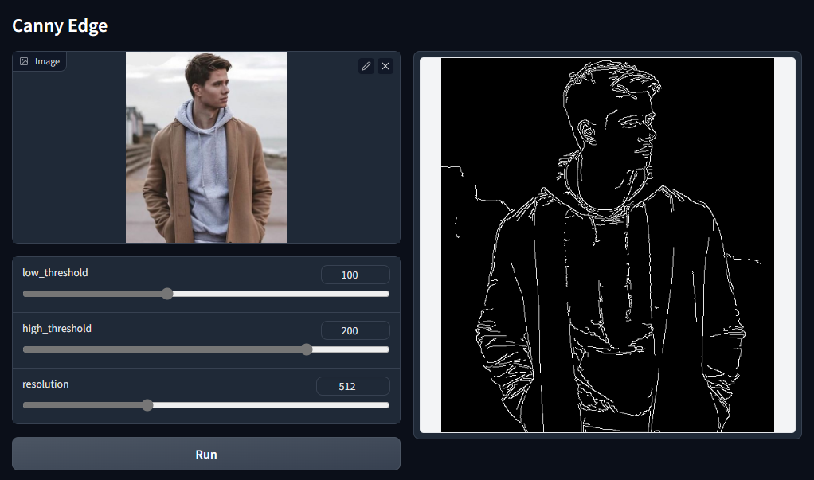
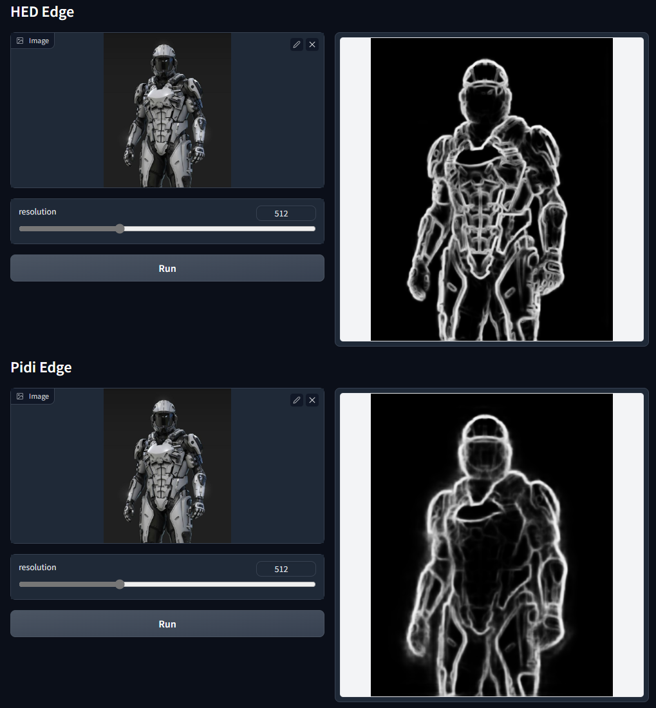
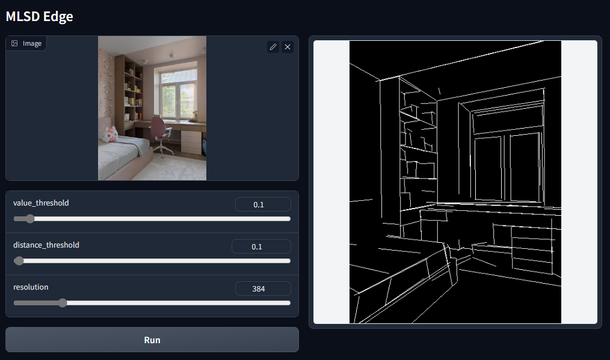
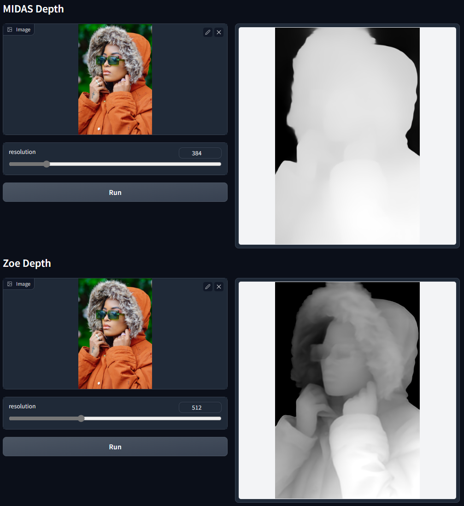
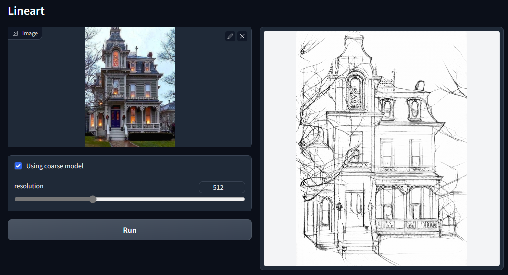
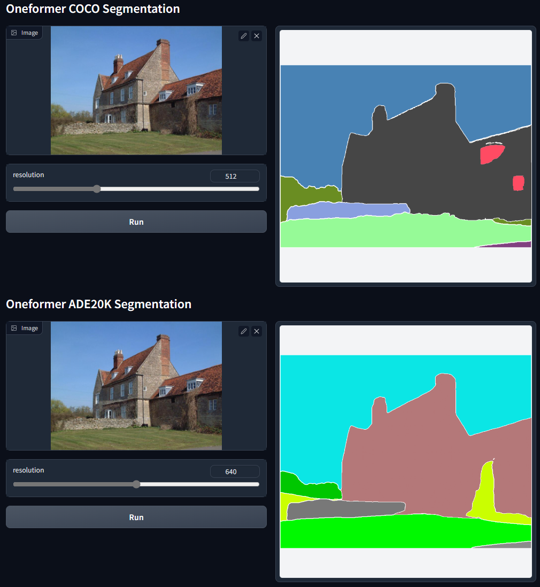
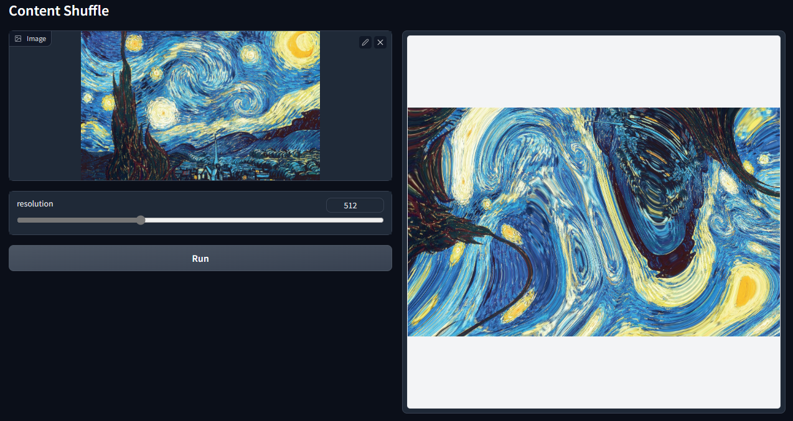
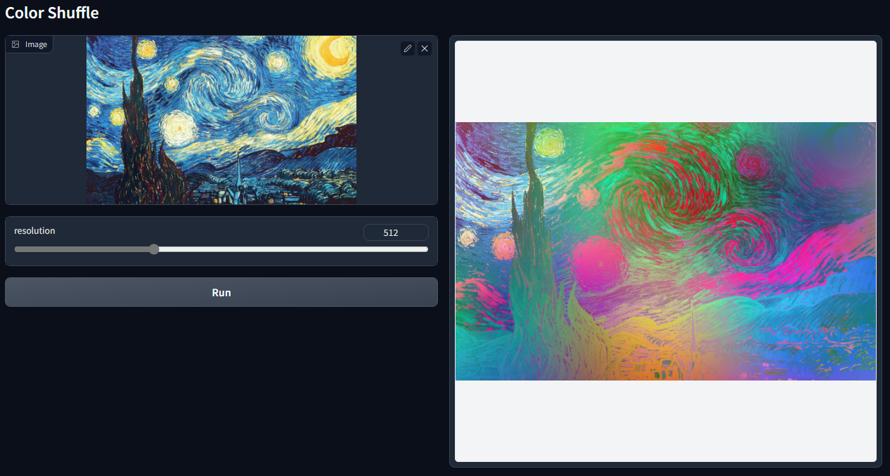

# AnnotatorV3

**Please keep this repo confidential before the release of ControlNet 1.1!**

AnnotatorV3 is a project conducted by ControlNet team to find out SOTA methods to interpret images.

All codes are production-ready: The installation is super easy and all codes are implemented with pure python and pure PyTorch and those "easy-to-install" packages.

The performance, quality, and inference "correctness" of all models are carefully reviewed by the ControlNet team to ensure that they are basically the correct implementation of SOTA models.

You do not need to install MMCV, Detectron2, MSDeformAttn, NATTEN, or any C-based or CUDA-based operations that need compiling and cause lots of troubles.

Also, no online TorchHub. Everything is offline.

# Just Try This

Just create a new conda environment and play with the demo

    git clone https://github.com/lllyasviel/AnnotatorV3.git
    cd AnnotatorV3    

    conda env create -f environment.yaml
    conda activate annotator-v3
    
    python gradio_annotator.py

The code will automatically download models. But if you want to download models manually, you can download all models [here](https://huggingface.co/lllyasviel/Annotators/tree/main), and put them in "AnnotatorV3\annotator\ckpts".

# Annotators

### Canny Edge

The canny edge detection - nothing special but very frequently used.

### Soft Edge

The soft edge of HED and PIDI. It seems that PIDI is more abstracted. 

Perhaps we can use both in training as a data augmentation.

# MLSD

The straight line detection.

# Depth

The quality of Midas is not as good as Zoe. Midas is faster and less "tricky" - Zoe uses some post-processing.

# Normal

[Bae's method](https://github.com/baegwangbin/surface_normal_uncertainty) to detect normal maps.

This method is significantly better than ControlNet 1.0's Normal-from-Midas.

Note that ControlNet 1.0's Normal-from-Midas will be abandoned, and we will move on to this annotator, and will not maintain the previous Normal-from-Midas anymore.

# Openpose

The ControlNet team made significant efforts to improve this. The differences are

(1) we fixed many bugs in previous implementation - and this implementation uses "correct" sampling methods and has better accuracy, especially for hands.

(2) Face landmarks are added.

Multiple people in the wild:

# Lineart (Anime)

This is Mukosame/Anime2Sketch.

# Lineart (Realistic)

This is awacke1/Image-to-Line-Drawings.

It turns real photo to linearts. It has two mode: the detailed mode and coarse mode.

Detailed mode:

Coarse mode:

# Semantic Segmentation

Below is our previous Uniformer. This model is out-of-date and will be replaced by OneFormer. Nevertheless, uniformer is still a very valid model and can be used in training as data augmentations - perhaps.

This is OneFormer. This method is SOTA. The ControlNet team made significant efforts to remove unnecessary dependencies so that anyone can use this model in nearly any environment without worrying about many difficult dependencies.

# Content Reshuffle

Use a simple random flow to reshuffle the content of an image. This can be used to train style-based ControlNets without being limited to the model scope of Clip-Vision tokenizer. 

We already see many clip-based token-based methods and none of them can very accurately reproduce the style of input images. Let us see will this method be much better.

This method should work because ControlNet Encoder has many self-attentions and cross-attentions.

This may also result in several interesting applications.

# Color Reshuffle

Randomly shuffle the color of each pixel but preserve the image structure. 

Useful in training re-coloring ControlNets.

