# ControlNet 1.1

This is the official release of ControlNet 1.1.

ControlNet 1.1 has the exactly same architecture with ControlNet 1.0. 

We promise that we will not change the neural network architecture before ControlNet 1.5 (at least, and hopefully we will never change the network architecture). Perhaps this is the best news in ControlNet 1.1.

ControlNet 1.1 includes all previous models with improved robustness and result quality. Several new models are added.

Note that we are still working on [updating this to A1111](https://github.com/Mikubill/sd-webui-controlnet/issues/736). 

This repo will be merged to [ControlNet](https://github.com/lllyasviel/ControlNet) after we make sure that everything is OK.

**Note that we are actively editing this page now. The information in this page will be more detailed and finalized when ControlNet 1.1 is ready.**

# This Github Repo is NOT an A1111 Extension

Please do not copy the URL of this repo into your A1111.

If you want to use ControlNet 1.1 in A1111, you only need to install https://github.com/Mikubill/sd-webui-controlnet , and only follow the instructions in that page.

This project is for research use and academic experiments. Again, do NOT install "ControlNet-v1-1-nightly" into your A1111.

# How to use ControlNet 1.1 in A1111?

The Beta Test for A1111 Is Started. 

The A1111 plugin is: https://github.com/Mikubill/sd-webui-controlnet

Note that if you use A1111, you only need to follow the instructions in the above link. (You can ignore all installation steps in this page if you use A1111.)

**For researchers who are not familiar with A1111:** The A1111 plugin supports arbitrary combination of arbitrary number of ControlNets, arbitrary community models, arbitrary LoRAs, and arbitrary sampling methods! We should definitely try it!

Note that our official support for “Multi-ControlNet” is A1111-only. Please use [Automatic1111 with Multi-ControlNet](https://github.com/Mikubill/sd-webui-controlnet#Multi-ControlNet) if you want to use multiple ControlNets at the same time. The ControlNet project perfectly supports combining multiple ControlNets, and all production-ready ControlNets are extensively tested with multiple ControlNets combined.

# Model Specification

Starting from ControlNet 1.1, we begin to use the Standard ControlNet Naming Rules (SCNNRs) to name all models. We hope that this naming rule can improve the user experience.

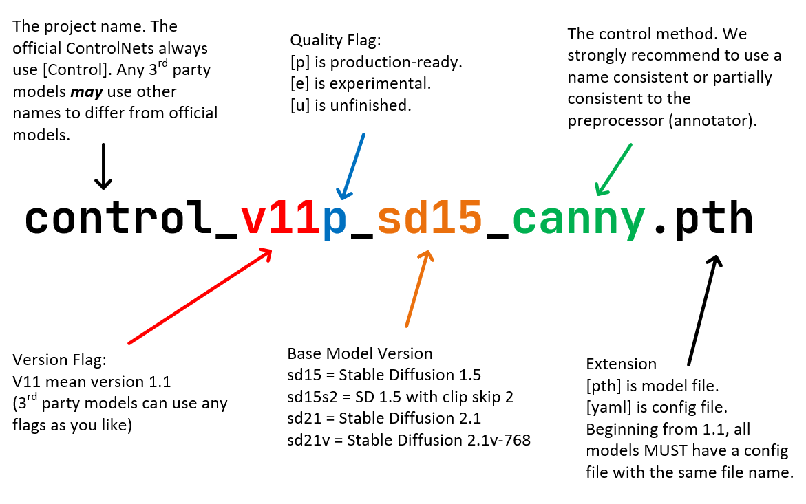

ControlNet 1.1 include 14 models (11 production-ready models and 3 experimental models):

    control_v11p_sd15_canny
    control_v11p_sd15_mlsd
    control_v11f1p_sd15_depth
    control_v11p_sd15_normalbae
    control_v11p_sd15_seg
    control_v11p_sd15_inpaint
    control_v11p_sd15_lineart
    control_v11p_sd15s2_lineart_anime
    control_v11p_sd15_openpose
    control_v11p_sd15_scribble
    control_v11p_sd15_softedge
    control_v11e_sd15_shuffle
    control_v11e_sd15_ip2p
    control_v11f1e_sd15_tile

You can download all those models from our [HuggingFace Model Page](https://huggingface.co/lllyasviel/ControlNet-v1-1/tree/main). All these models should be put in the folder "models".

You need to download Stable Diffusion 1.5 model ["v1-5-pruned.ckpt"](https://huggingface.co/runwayml/stable-diffusion-v1-5/tree/main) and put it in the folder "models".

Our python codes will automatically download other annotator models like HED and OpenPose. Nevertheless, if you want to manually download these, you can download all other annotator models from [here](https://huggingface.co/lllyasviel/Annotators/tree/main). All these models should be put in folder "annotator/ckpts". 

To install:

    conda env create -f environment.yaml
    conda activate control-v11

Note that if you use 8GB GPU, you need to set "save_memory = True" in "config.py".

## ControlNet 1.1 Depth

Control Stable Diffusion with Depth Maps.

Model file: control_v11f1p_sd15_depth.pth

Config file: control_v11f1p_sd15_depth.yaml

Training data: Midas depth (resolution 256/384/512) + Leres Depth (resolution 256/384/512) + Zoe Depth (resolution 256/384/512). Multiple depth map generator at multiple resolution as data augmentation.

Acceptable Preprocessors: Depth_Midas, Depth_Leres, Depth_Zoe. This model is highly robust and can work on real depth map from rendering engines.

    python gradio_depth.py

Non-cherry-picked batch test with random seed 12345 ("a handsome man"):

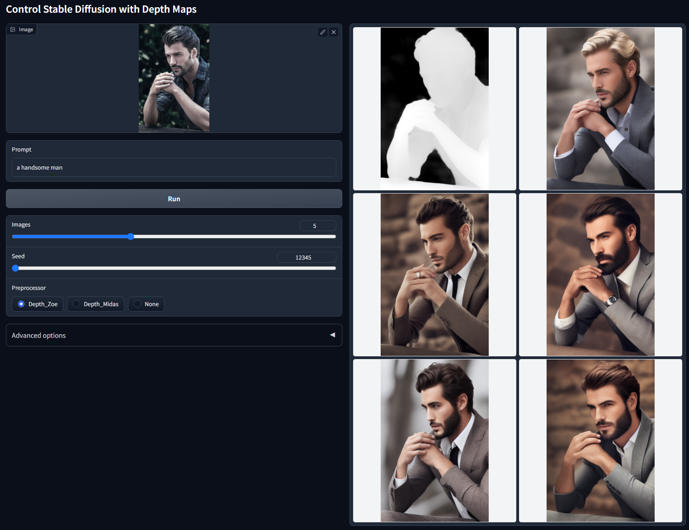

**Update**

2023/04/14: 72 hours ago we uploaded a wrong model "control_v11p_sd15_depth" by mistake. That model is an intermediate checkpoint during the training. That model is not converged and may cause distortion in results. We uploaded the correct depth model as "control_v11f1p_sd15_depth". The "f1" means bug fix 1. The incorrect model is removed. Sorry for the inconvenience.

**Improvements in Depth 1.1:**

1. The training dataset of previous cnet 1.0 has several problems including (1) a small group of greyscale human images are duplicated thousands of times (!!), causing the previous model somewhat likely to generate grayscale human images; (2) some images has low quality, very blurry, or significant JPEG artifacts; (3) a small group of images has wrong paired prompts caused by a mistake in our data processing scripts. The new model fixed all problems of the training dataset and should be more reasonable in many cases.
2. The new depth model is a relatively unbiased model. It is not trained with some specific type of depth by some specific depth estimation method. It is not over-fitted to one preprocessor. This means this model will work better with different depth estimation, different preprocessor resolutions, or even with real depth created by 3D engines.
3. Some reasonable data augmentations are applied to training, like random left-right flipping.
4. The model is resumed from depth 1.0, and it should work well in all cases where depth 1.0 works well. If not, please open an issue with image, and we will take a look at your case. Depth 1.1 works well in many failure cases of depth 1.0.
5. If you use Midas depth (the "depth" in webui plugin) with 384 preprocessor resolution, the difference between depth 1.0 and 1.1 should be minimal. However, if you try other preprocessor resolutions or other preprocessors (like leres and zoe), the depth 1.1 is expected to be a bit better than 1.0.

## ControlNet 1.1 Normal

Control Stable Diffusion with Normal Maps.

Model file: control_v11p_sd15_normalbae.pth

Config file: control_v11p_sd15_normalbae.yaml

Training data: [Bae's](https://github.com/baegwangbin/surface_normal_uncertainty) normalmap estimation method.

Acceptable Preprocessors: Normal BAE. This model can accept normal maps from rendering engines as long as the normal map follows [ScanNet's](http://www.scan-net.org/) protocol. That is to say, the color of your normal map should look like [the second column of this image](https://raw.githubusercontent.com/baegwangbin/surface_normal_uncertainty/main/figs/readme_scannet.png).

Note that this method is much more reasonable than the normal-from-midas method in ControlNet 1.0. The previous method will be abandoned.

    python gradio_normalbae.py

Non-cherry-picked batch test with random seed 12345 ("a man made of flowers"):

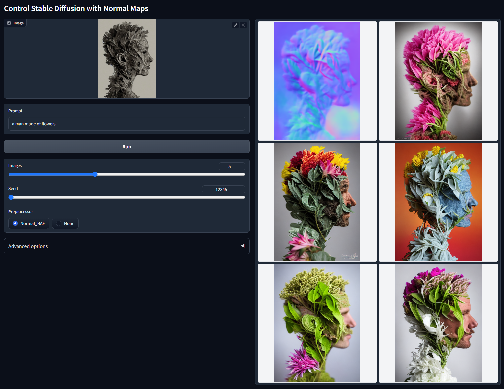

Non-cherry-picked batch test with random seed 12345 ("room"):

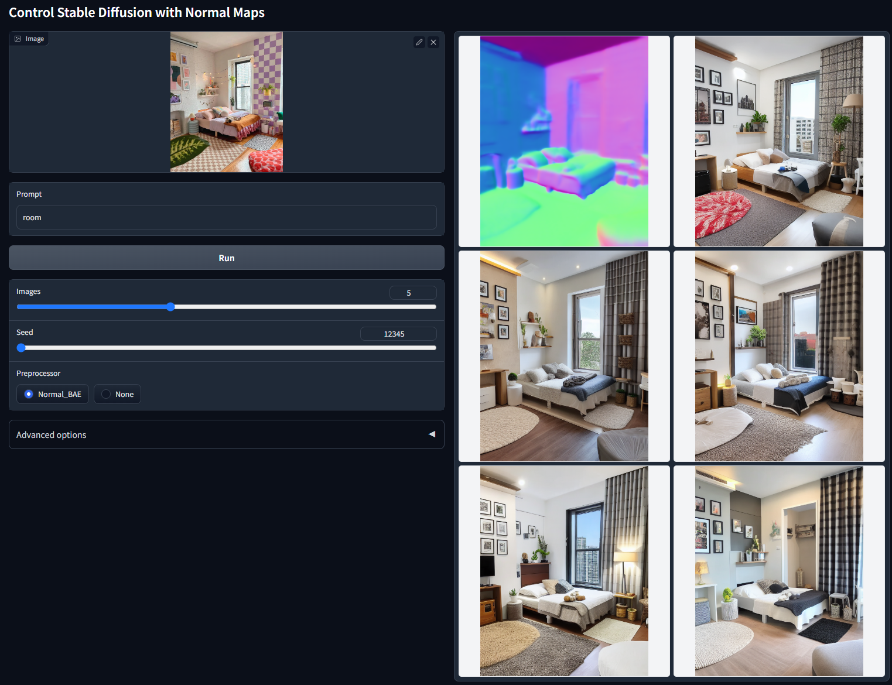

**Improvements in Normal 1.1:**

1. The normal-from-midas method in Normal 1.0 is neither reasonable nor physically correct. That method does not work very well in many images. The normal 1.0 model cannot interpret real normal maps created by rendering engines.
2. This Normal 1.1 is much more reasonable because the preprocessor is trained to estimate normal maps with a relatively correct protocol (NYU-V2's visualization method). This means the Normal 1.1 can interpret real normal maps from rendering engines as long as the colors are correct (blue is front, red is left, green is top).
3. In our test, this model is robust and can achieve similar performance to the depth model. In previous CNET 1.0, the Normal 1.0 is not very frequently used. But this Normal 2.0 is much improved and has potential to be used much more frequently.

## ControlNet 1.1 Canny

Control Stable Diffusion with Canny Maps.

Model file: control_v11p_sd15_canny.pth

Config file: control_v11p_sd15_canny.yaml

Training data: Canny with random thresholds.

Acceptable Preprocessors: Canny.

We fixed several problems in previous training datasets.

    python gradio_canny.py

Non-cherry-picked batch test with random seed 12345 ("dog in a room"):

**Improvements in Canny 1.1:**

1. The training dataset of previous cnet 1.0 has several problems including (1) a small group of greyscale human images are duplicated thousands of times (!!), causing the previous model somewhat likely to generate grayscale human images; (2) some images has low quality, very blurry, or significant JPEG artifacts; (3) a small group of images has wrong paired prompts caused by a mistake in our data processing scripts. The new model fixed all problems of the training dataset and should be more reasonable in many cases.
2. Because the Canny model is one of the most important (perhaps the most frequently used) ControlNet, we used a fund to train it on a machine with 8 Nvidia A100 80G with batchsize 8×32=256 for 3 days, spending 72×30=2160 USD (8 A100 80G with 30 USD/hour). The model is resumed from Canny 1.0.
3. Some reasonable data augmentations are applied to training, like random left-right flipping.
4. Although it is difficult to evaluate a ControlNet, we find Canny 1.1 is a bit more robust and a bit higher visual quality than Canny 1.0. 

## ControlNet 1.1 MLSD

Control Stable Diffusion with M-LSD straight lines.

Model file: control_v11p_sd15_mlsd.pth

Config file: control_v11p_sd15_mlsd.yaml

Training data: M-LSD Lines.

Acceptable Preprocessors: MLSD.

We fixed several problems in previous training datasets. The model is resumed from ControlNet 1.0 and trained with 200 GPU hours of A100 80G.

    python gradio_mlsd.py

Non-cherry-picked batch test with random seed 12345 ("room"):

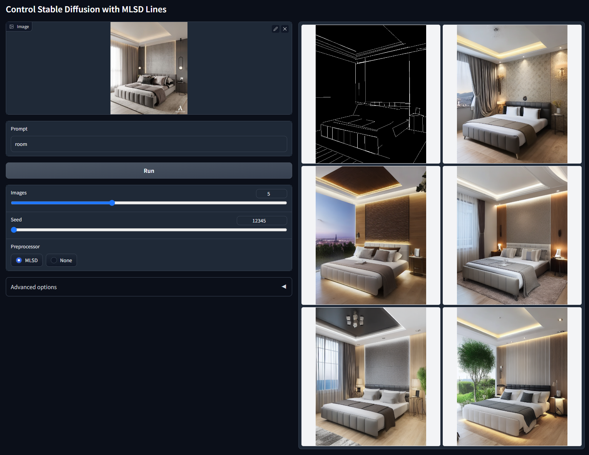

**Improvements in MLSD 1.1:**

1. The training dataset of previous cnet 1.0 has several problems including (1) a small group of greyscale human images are duplicated thousands of times (!!), causing the previous model somewhat likely to generate grayscale human images; (2) some images has low quality, very blurry, or significant JPEG artifacts; (3) a small group of images has wrong paired prompts caused by a mistake in our data processing scripts. The new model fixed all problems of the training dataset and should be more reasonable in many cases.
2. We enlarged the training dataset by adding 300K more images by using MLSD to find images with more than 16 straight lines in it.
3. Some reasonable data augmentations are applied to training, like random left-right flipping.
4. Resumed from MLSD 1.0 with continued training with 200 GPU hours of A100 80G.

## ControlNet 1.1 Scribble

Control Stable Diffusion with Scribbles.

Model file: control_v11p_sd15_scribble.pth

Config file: control_v11p_sd15_scribble.yaml

Training data: Synthesized scribbles.

Acceptable Preprocessors: Synthesized scribbles (Scribble_HED, Scribble_PIDI, etc.) or hand-drawn scribbles.

We fixed several problems in previous training datasets. The model is resumed from ControlNet 1.0 and trained with 200 GPU hours of A100 80G.

    # To test synthesized scribbles
    python gradio_scribble.py
    # To test hand-drawn scribbles in an interactive demo
    python gradio_interactive.py

Non-cherry-picked batch test with random seed 12345 ("man in library"):

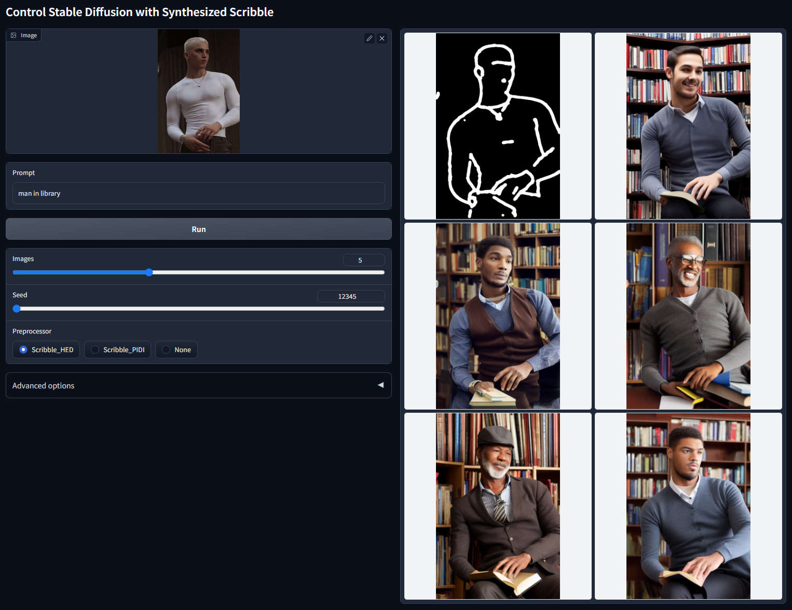

Non-cherry-picked batch test with random seed 12345 (interactive, "the beautiful landscape"):

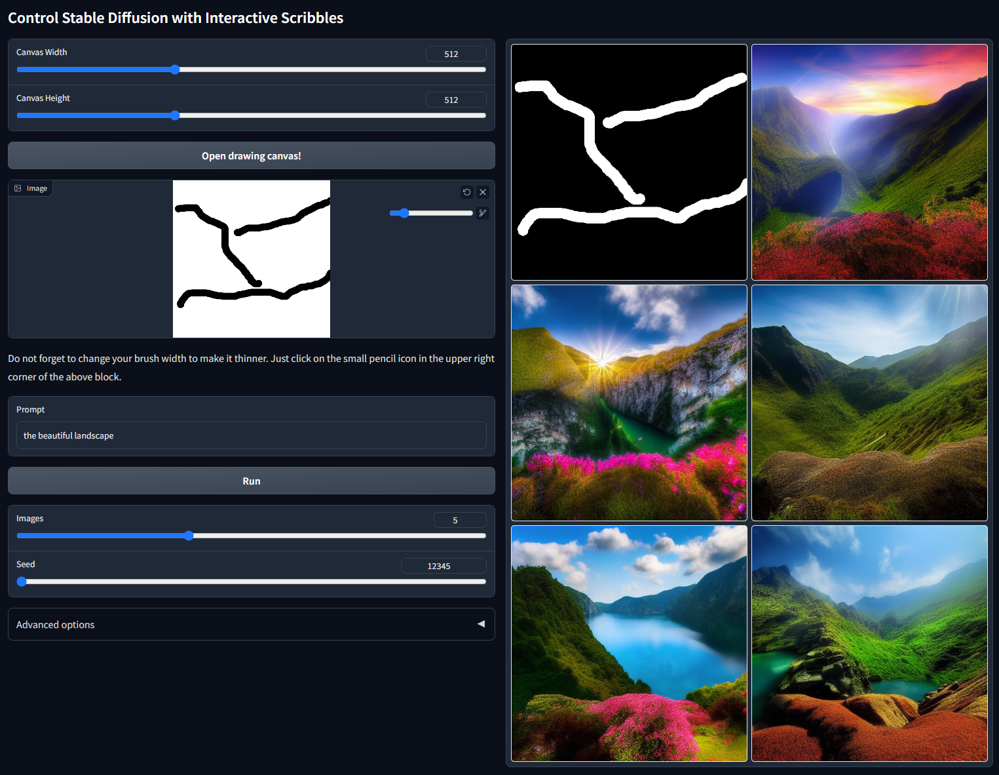

**Improvements in Scribble 1.1:**

1. The training dataset of previous cnet 1.0 has several problems including (1) a small group of greyscale human images are duplicated thousands of times (!!), causing the previous model somewhat likely to generate grayscale human images; (2) some images has low quality, very blurry, or significant JPEG artifacts; (3) a small group of images has wrong paired prompts caused by a mistake in our data processing scripts. The new model fixed all problems of the training dataset and should be more reasonable in many cases.
2. We find out that users sometimes like to draw very thick scribbles. Because of that, we used more aggressive random morphological transforms to synthesize scribbles. This model should work well even when the scribbles are relatively thick (the maximum width of training data is 24-pixel-width scribble in a 512 canvas, but it seems to work well even for a bit wider scribbles; the minimum width is 1 pixel).
3. Resumed from Scribble 1.0, continued with 200 GPU hours of A100 80G.

## ControlNet 1.1 Soft Edge

Control Stable Diffusion with Soft Edges.

Model file: control_v11p_sd15_softedge.pth

Config file: control_v11p_sd15_softedge.yaml

Training data: SoftEdge_PIDI, SoftEdge_PIDI_safe, SoftEdge_HED, SoftEdge_HED_safe.

Acceptable Preprocessors: SoftEdge_PIDI, SoftEdge_PIDI_safe, SoftEdge_HED, SoftEdge_HED_safe.

This model is significantly improved compared to previous model. All users should update as soon as possible.

New in ControlNet 1.1: now we added a new type of soft edge called "SoftEdge_safe". This is motivated by the fact that HED or PIDI tends to hide a corrupted greyscale version of the original image inside the soft estimation, and such hidden patterns can distract ControlNet, leading to bad results. The solution is to use a pre-processing to quantize the edge maps into several levels so that the hidden patterns can be completely removed. The implementation is [in the 78-th line of annotator/util.py](https://github.com/lllyasviel/ControlNet-v1-1-nightly/blob/4c9560ebe7679daac53a0599a11b9b7cd984ac55/annotator/util.py#L78).

The perforamce can be roughly noted as:

Robustness: SoftEdge_PIDI_safe > SoftEdge_HED_safe >> SoftEdge_PIDI > SoftEdge_HED

Maximum result quality: SoftEdge_HED > SoftEdge_PIDI > SoftEdge_HED_safe > SoftEdge_PIDI_safe

Considering the trade-off, we recommend to use SoftEdge_PIDI by default. In most cases it works very well.

    python gradio_softedge.py

Non-cherry-picked batch test with random seed 12345 ("a handsome man"):

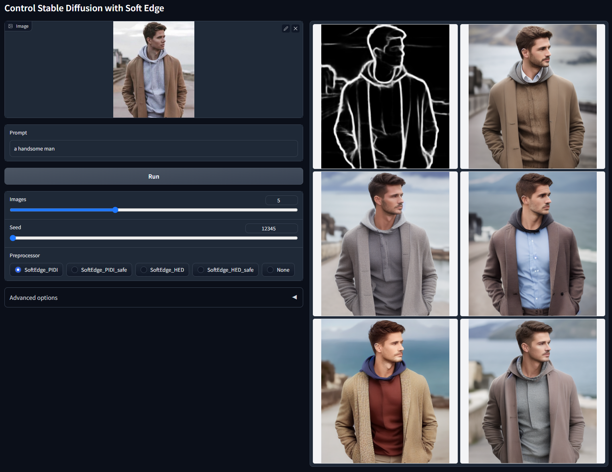

**Improvements in Soft Edge 1.1:**

1. Soft Edge 1.1 was called HED 1.0 in previous ControlNet.
2. The training dataset of previous cnet 1.0 has several problems including (1) a small group of greyscale human images are duplicated thousands of times (!!), causing the previous model somewhat likely to generate grayscale human images; (2) some images has low quality, very blurry, or significant JPEG artifacts; (3) a small group of images has wrong paired prompts caused by a mistake in our data processing scripts. The new model fixed all problems of the training dataset and should be more reasonable in many cases.
3. The Soft Edge 1.1 is significantly (in nealy 100\% cases) better than HED 1.0. This is mainly because HED or PIDI estimator tend to hide a corrupted greyscale version of original image inside the soft edge map and the previous model HED 1.0 is over-fitted to restore that hidden corrupted image rather than perform boundary-aware diffusion. The training of Soft Edge 1.1 used 75\% "safe" filtering to remove such hidden corrupted greyscale images insider control maps. This makes the Soft Edge 1.1 very robust. In out test, Soft Edge 1.1 is as usable as the depth model and has potential to be more frequently used.

## ControlNet 1.1 Segmentation

Control Stable Diffusion with Semantic Segmentation.

Model file: control_v11p_sd15_seg.pth

Config file: control_v11p_sd15_seg.yaml

Training data: COCO + ADE20K.

Acceptable Preprocessors: Seg_OFADE20K (Oneformer ADE20K), Seg_OFCOCO (Oneformer COCO), Seg_UFADE20K (Uniformer ADE20K), or manually created masks.

Now the model can receive both type of ADE20K or COCO annotations. We find that recognizing the segmentation protocol is trivial for the ControlNet encoder and training the model of multiple segmentation protocols lead to better performance.

    python gradio_seg.py

Non-cherry-picked batch test with random seed 12345 (ADE20k protocol, "house"):

Non-cherry-picked batch test with random seed 12345 (COCO protocol, "house"):

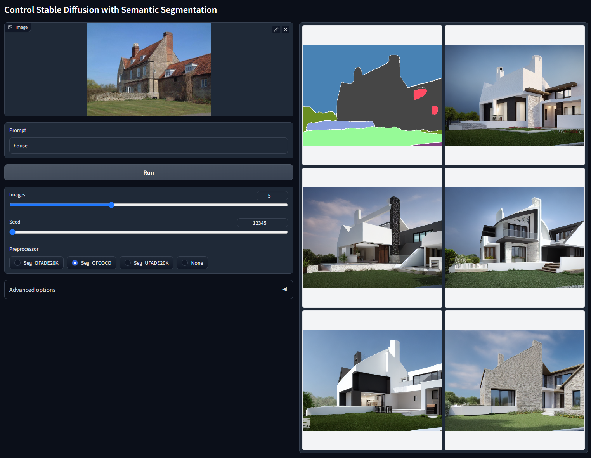

**Improvements in Segmentation 1.1:**

1. COCO protocol is supported. The previous Segmentation 1.0 supports about 150 colors, but Segmentation 1.1 supports another 182 colors from coco.
2. Resumed from Segmentation 1.0. All previous inputs should still work.

## ControlNet 1.1 Openpose

Control Stable Diffusion with Openpose.

Model file: control_v11p_sd15_openpose.pth

Config file: control_v11p_sd15_openpose.yaml

The model is trained and can accept the following combinations:

* Openpose body
* Openpose hand
* Openpose face
* Openpose body + Openpose hand
* Openpose body + Openpose face
* Openpose hand + Openpose face
* Openpose body + Openpose hand + Openpose face

However, providing all those combinations is too complicated. We recommend to provide the users with only two choices:

* "Openpose" = Openpose body
* "Openpose Full" = Openpose body + Openpose hand + Openpose face

You can try with the demo:

    python gradio_openpose.py

Non-cherry-picked batch test with random seed 12345 ("man in suit"):

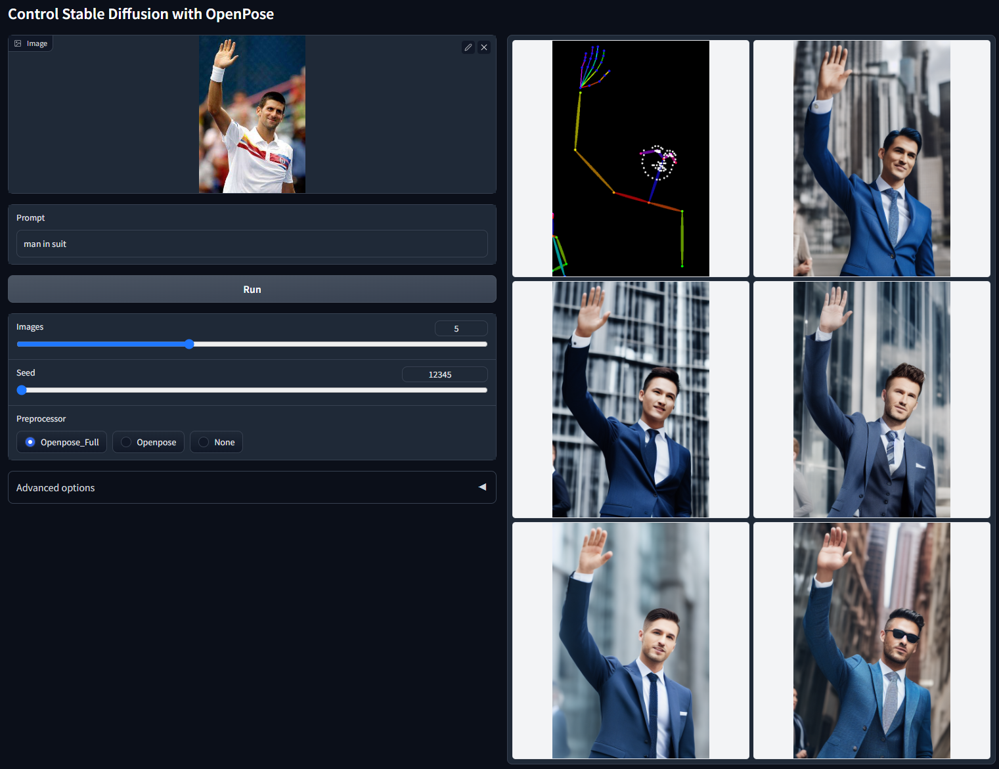

Non-cherry-picked batch test with random seed 12345 (multiple people in the wild, "handsome boys in the party"):

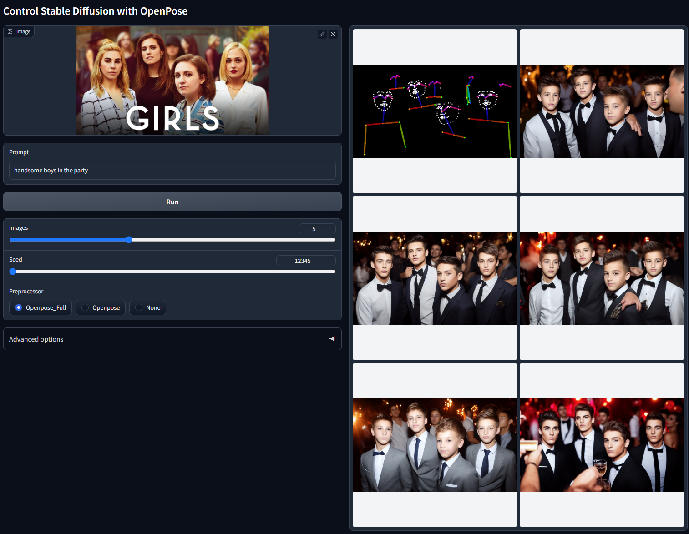

**Improvements in Openpose 1.1:**

1. The improvement of this model is mainly based on our improved implementation of OpenPose. We carefully reviewed the difference between the pytorch OpenPose and CMU's c++ openpose. Now the processor should be more accurate, especially for hands. The improvement of processor leads to the improvement of Openpose 1.1.
2. More inputs are supported (hand and face).
3. The training dataset of previous cnet 1.0 has several problems including (1) a small group of greyscale human images are duplicated thousands of times (!!), causing the previous model somewhat likely to generate grayscale human images; (2) some images has low quality, very blurry, or significant JPEG artifacts; (3) a small group of images has wrong paired prompts caused by a mistake in our data processing scripts. The new model fixed all problems of the training dataset and should be more reasonable in many cases.

## ControlNet 1.1 Lineart

Control Stable Diffusion with Linearts.

Model file: control_v11p_sd15_lineart.pth

Config file: control_v11p_sd15_lineart.yaml

This model is trained on awacke1/Image-to-Line-Drawings. The preprocessor can generate detailed or coarse linearts from images (Lineart and Lineart_Coarse). The model is trained with sufficient data augmentation and can receive manually drawn linearts.

    python gradio_lineart.py

Non-cherry-picked batch test with random seed 12345 (detailed lineart extractor, "bag"):

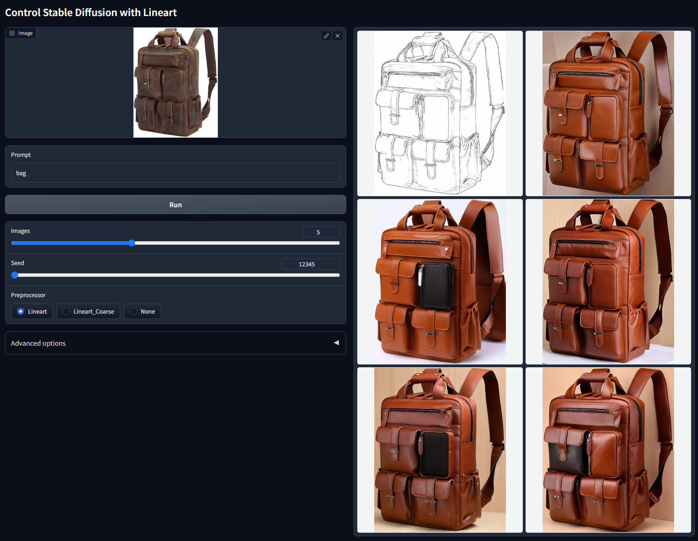

Non-cherry-picked batch test with random seed 12345 (coarse lineart extractor, "Michael Jackson's concert"):

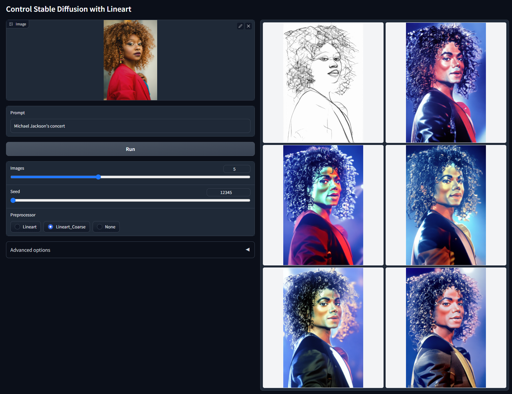

Non-cherry-picked batch test with random seed 12345 (use manually drawn linearts, "wolf"):

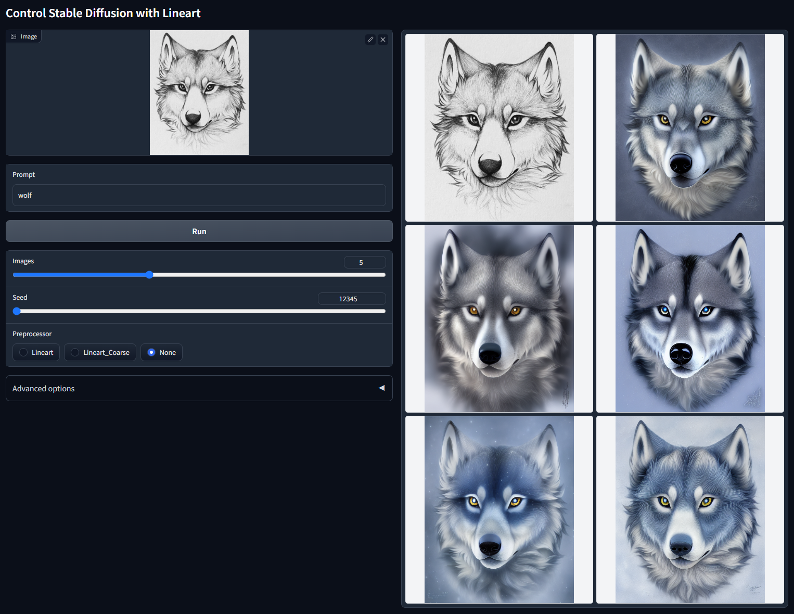

## ControlNet 1.1 Anime Lineart

Control Stable Diffusion with Anime Linearts.

Model file: control_v11p_sd15s2_lineart_anime.pth

Config file: control_v11p_sd15s2_lineart_anime.yaml

Training data and implementation details: (description removed).

This model can take real anime line drawings or extracted line drawings as inputs.

Some important notice:

1. You need a file "anything-v3-full.safetensors" to run the demo. We will not provide the file. Please find that file on the Internet on your own.
2. This model is trained with 3x token length and clip skip 2.
3. This is a long prompt model. Unless you use LoRAs, results are better with long prompts.
4. This model does not support Guess Mode.

Demo:

    python gradio_lineart_anime.py

Non-cherry-picked batch test with random seed 12345 ("1girl, in classroom, skirt, uniform, red hair, bag, green eyes"):

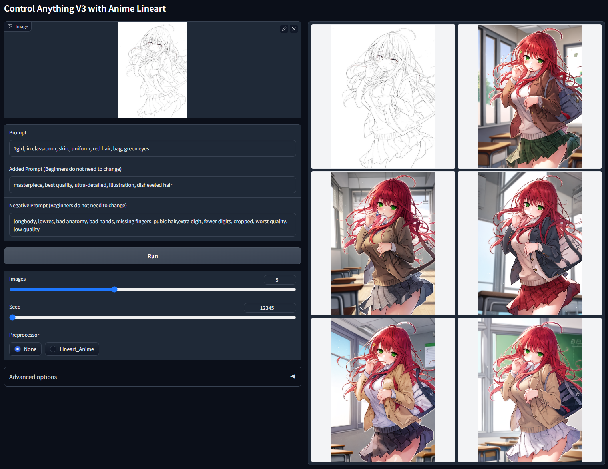

Non-cherry-picked batch test with random seed 12345 ("1girl, saber, at night, sword, green eyes, golden hair, stocking"):

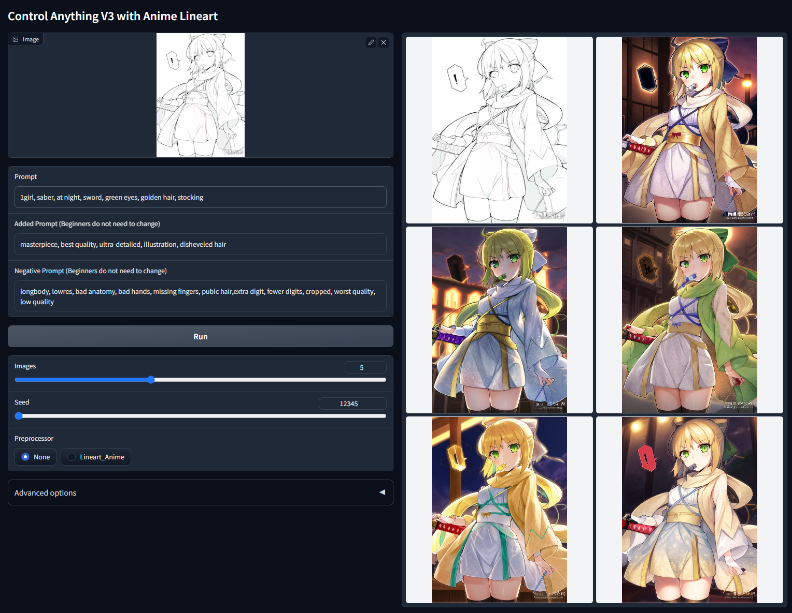

Non-cherry-picked batch test with random seed 12345 (extracted line drawing, "1girl, Castle, silver hair, dress, Gemstone, cinematic lighting, mechanical hand, 4k, 8k, extremely detailed, Gothic, green eye"):

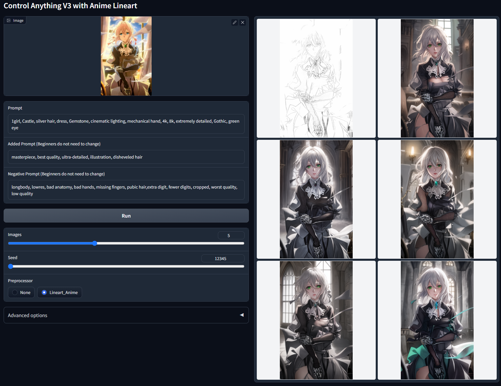

## ControlNet 1.1 Shuffle

Control Stable Diffusion with Content Shuffle.

Model file: control_v11e_sd15_shuffle.pth

Config file: control_v11e_sd15_shuffle.yaml

Demo:

    python gradio_shuffle.py

The model is trained to reorganize images. [We use a random flow to shuffle the image and control Stable Diffusion to recompose the image.](github_docs/annotator.md#content-reshuffle)

Non-cherry-picked batch test with random seed 12345 ("hong kong"):

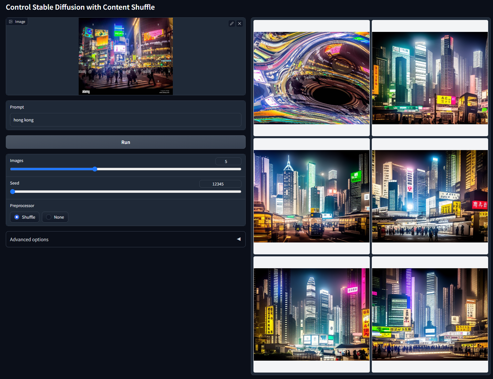

In the 6 images on the right, the left-top one is the "shuffled" image. All others are outputs.

In fact, since the ControlNet is trained to recompose images, we do not even need to shuffle the input - sometimes we can just use the original image as input.

In this way, this ControlNet can be guided by prompts or other ControlNets to change the image style.

Note that this method has nothing to do with CLIP vision or some other models. 

This is a pure ControlNet.

Non-cherry-picked batch test with random seed 12345 ("iron man"):

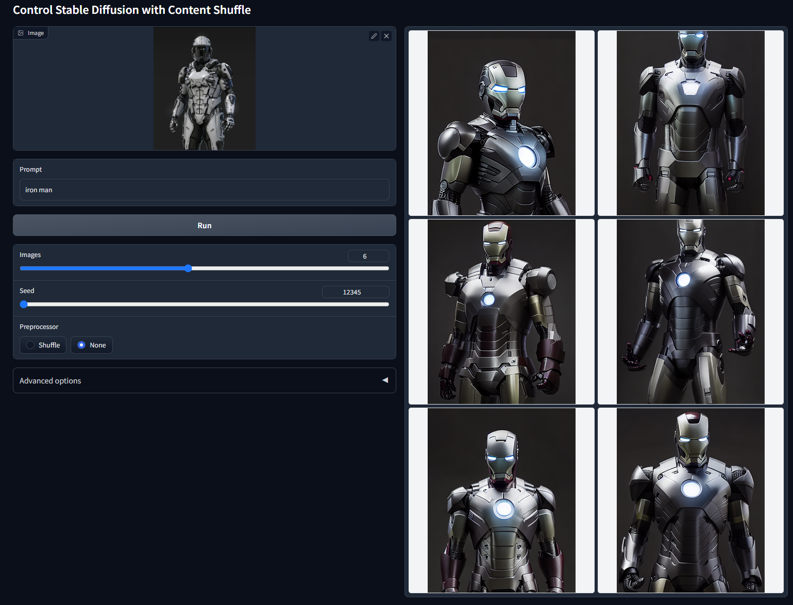

Non-cherry-picked batch test with random seed 12345 ("spider man"):

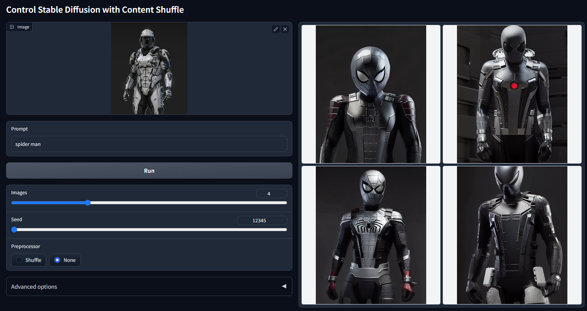

**Multi-ControlNets** (A1111-only)

Source Image (not used):

Canny Image (Input):

Shuffle Image (Input):

Outputs:

(From: https://github.com/Mikubill/sd-webui-controlnet/issues/736#issuecomment-1509986321)

**Important If You Implement Your Own Inference:**

Note that this ControlNet requires to add a global average pooling " x = torch.mean(x, dim=(2, 3), keepdim=True) " between the ControlNet Encoder outputs and SD Unet layers. And the ControlNet must be put only on the conditional side of cfg scale. We recommend to use the "global_average_pooling" item in the yaml file to control such behaviors.

~Note that this ControlNet Shuffle will be the one and only one image stylization method that we will maintain for the robustness in a long term support. We have tested other CLIP image encoder, Unclip, image tokenization, and image-based prompts but it seems that those methods do not work very well with user prompts or additional/multiple U-Net injections. See also the evidence [here](https://github.com/lllyasviel/ControlNet/issues/255), [here](https://github.com/Mikubill/sd-webui-controlnet/issues/547), and some other related issues.~ After some more recent researches/experiments, we plan to support more types of stylization methods in the future. 

## ControlNet 1.1 Instruct Pix2Pix

Control Stable Diffusion with Instruct Pix2Pix.

Model file: control_v11e_sd15_ip2p.pth

Config file: control_v11e_sd15_ip2p.yaml

Demo:

    python gradio_ip2p.py

This is a controlnet trained on the [Instruct Pix2Pix dataset](https://github.com/timothybrooks/instruct-pix2pix).

Different from official Instruct Pix2Pix, this model is trained with 50\% instruction prompts and 50\% description prompts. For example, "a cute boy" is a description prompt, while "make the boy cute" is a instruction prompt.

Because this is a ControlNet, you do not need to trouble with original IP2P's double cfg tuning. And, this model can be applied to any base model.

Also, it seems that instructions like "make it into X" works better than "make Y into X".

Non-cherry-picked batch test with random seed 12345 ("make it on fire"):

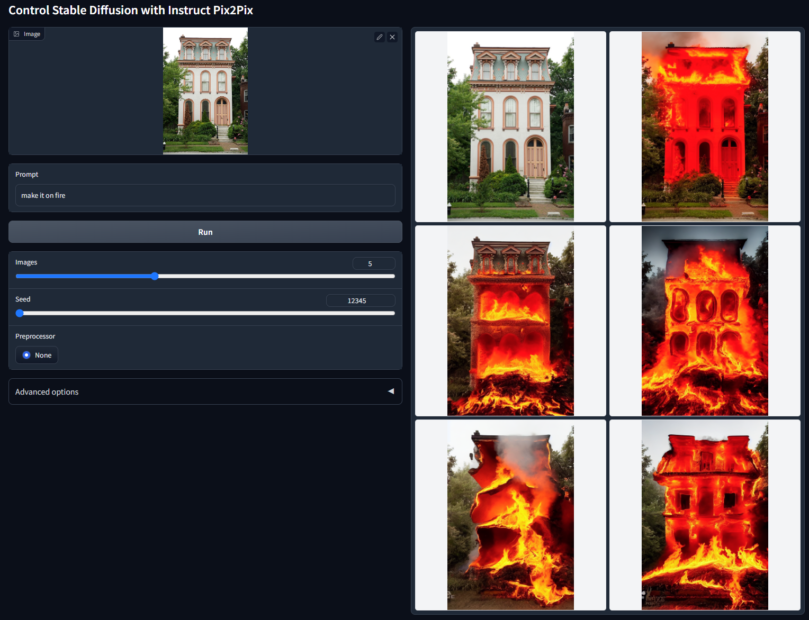

Non-cherry-picked batch test with random seed 12345 ("make it winter"):

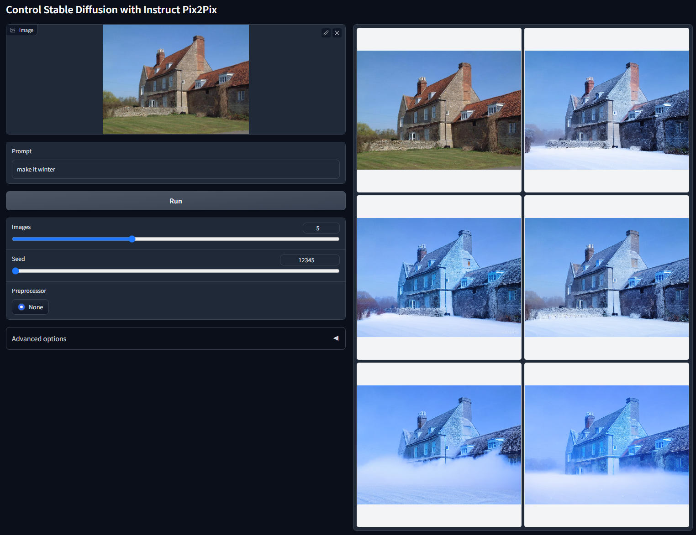

We mark this model as "experimental" because it sometimes needs cherry-picking. For example, here is non-cherry-picked batch test with random seed 12345 ("make he iron man"):

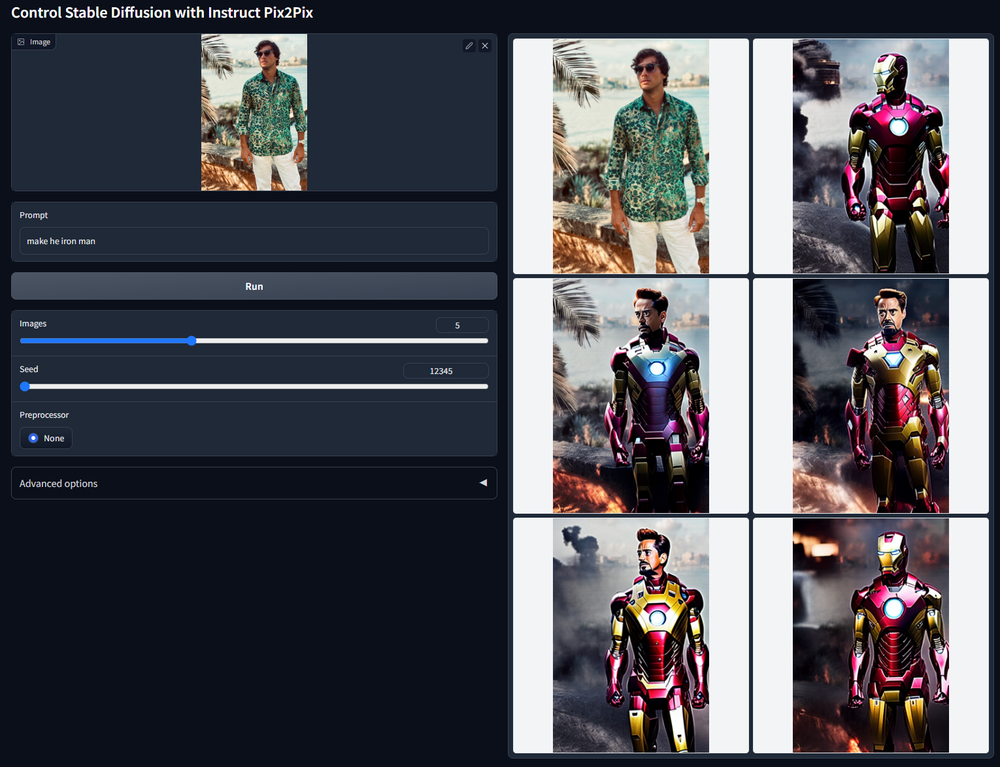

## ControlNet 1.1 Inpaint

Control Stable Diffusion with Inpaint.

Model file: control_v11p_sd15_inpaint.pth

Config file: control_v11p_sd15_inpaint.yaml

Demo:

    python gradio_inpaint.py

Some notices:

1. This inpainting ControlNet is trained with 50\% random masks and 50\% random optical flow occlusion masks. This means the model can not only support the inpainting application but also work on video optical flow warping. Perhaps we will provide some example in the future (depending on our workloads).
2. We updated the gradio (2023/5/11) so that the standalone gradio codes in main ControlNet repo also do not change unmasked areas. Automatic 1111 users are not influenced.

Non-cherry-picked batch test with random seed 12345 ("a handsome man"):

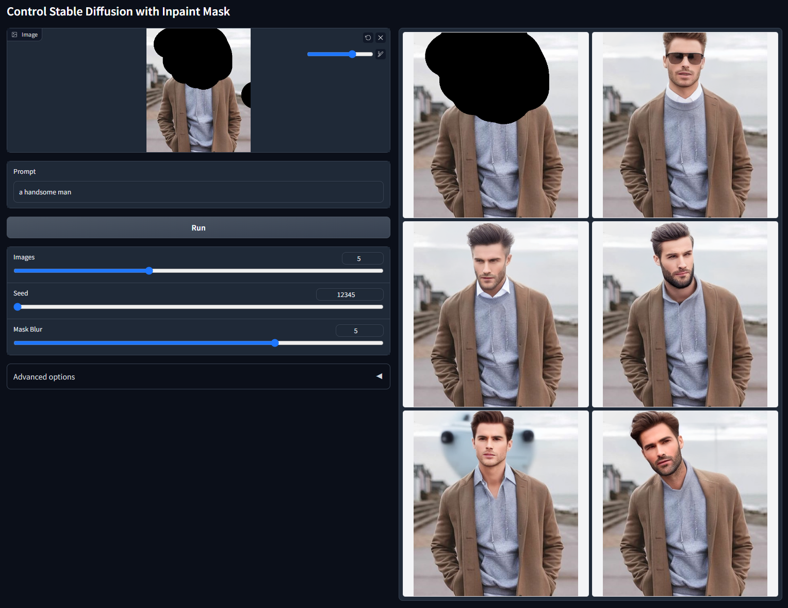

See also the Guidelines for [Using ControlNet Inpaint in Automatic 1111](https://github.com/Mikubill/sd-webui-controlnet/discussions/1143).

## ControlNet 1.1 Tile

Update 2023 April 25: The previously unfinished tile model is finished now. The new name is "control_v11f1e_sd15_tile". The "f1e" means 1st bug fix ("f1"), experimental ("e").  The previous "control_v11u_sd15_tile" is removed. Please update if your model name is "v11u".

Control Stable Diffusion with Tiles.

Model file: control_v11f1e_sd15_tile.pth

Config file: control_v11f1e_sd15_tile.yaml

Demo:

    python gradio_tile.py

The model can be used in many ways. Overall, the model has two behaviors:

* Ignore the details in an image and generate new details.
* Ignore global prompts if local tile semantics and prompts mismatch, and guide diffusion with local context.

Because the model can generate new details and ignore existing image details, we can use this model to remove bad details and add refined details. For example, remove blurring caused by image resizing.

Below is an example of 8x super resolution. This is a 64x64 dog image.

Non-cherry-picked batch test with random seed 12345 ("dog on grassland"):

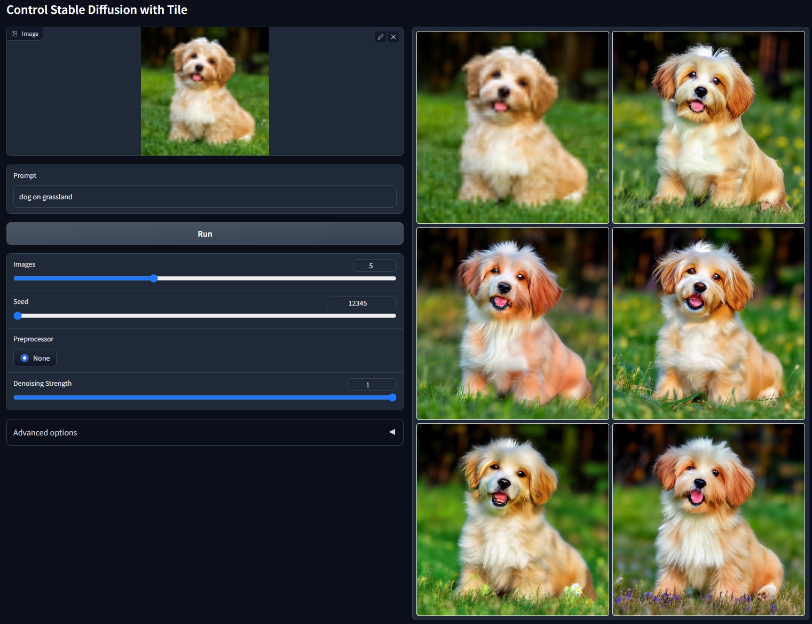

Note that this model is not a super resolution model. It ignores the details in an image and generate new details. This means you can use it to fix bad details in an image.

For example, below is a dog image corrupted by Real-ESRGAN. This is a typical example that sometimes super resolution methds fail to upscale images when source context is too small.

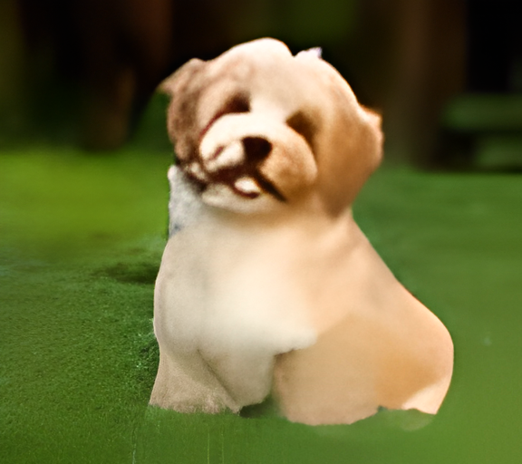

Non-cherry-picked batch test with random seed 12345 ("dog on grassland"):

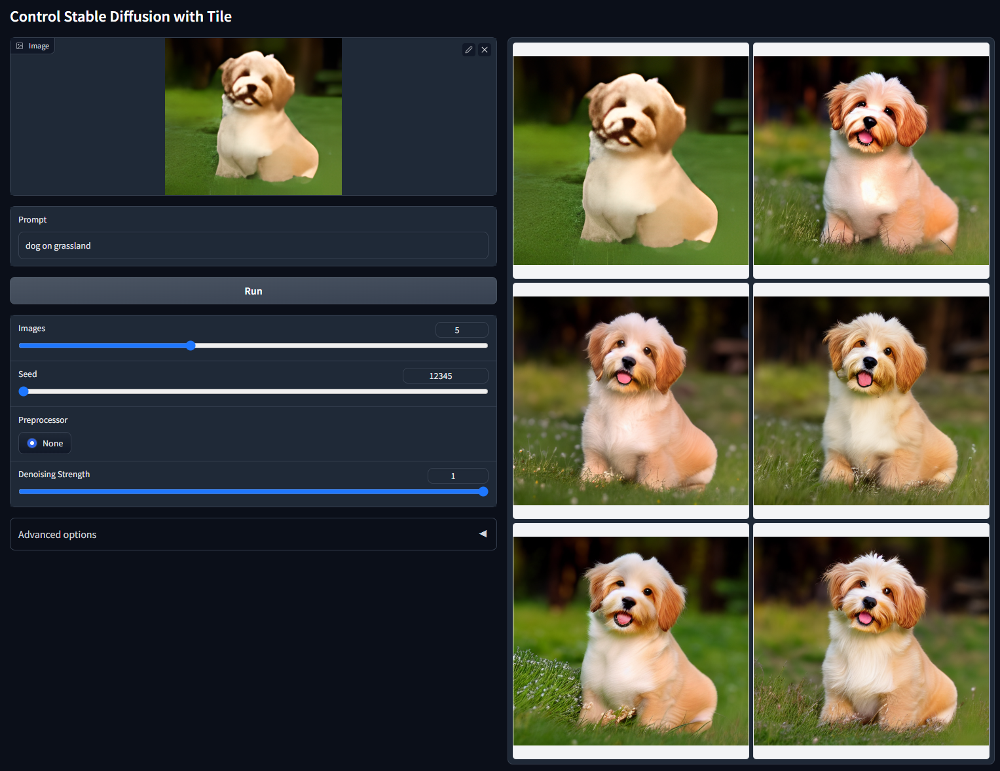

If your image already have good details, you can still use this model to replace image details. Note that Stable Diffusion's I2I can achieve similar effects but this model make it much easier for you to maintain the overall structure and only change details even with denoising strength 1.0 .

Non-cherry-picked batch test with random seed 12345 ("Silver Armor"):

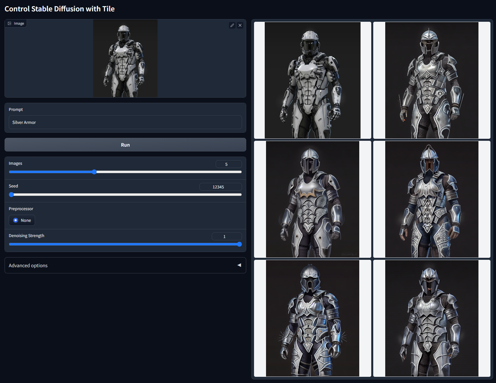

More and more people begin to think about different methods to diffuse at tiles so that images can be very big (at 4k or 8k). 

The problem is that, in Stable Diffusion, your prompts will always influent each tile.

For example, if your prompts are "a beautiful girl" and you split an image into 4×4=16 blocks and do diffusion in each block, then you are will get 16 "beautiful girls" rather than "a beautiful girl". This is a well-known problem.

Right now people's solution is to use some meaningless prompts like "clear, clear, super clear" to diffuse blocks. But you can expect that the results will be bad if the denonising strength is high. And because the prompts are bad, the contents are pretty random.

ControlNet Tile can solve this problem. For a given tile, it recognizes what is inside the tile and increase the influence of that recognized semantics, and it also decreases the influence of global prompts if contents do not match.

Non-cherry-picked batch test with random seed 12345 ("a handsome man"):

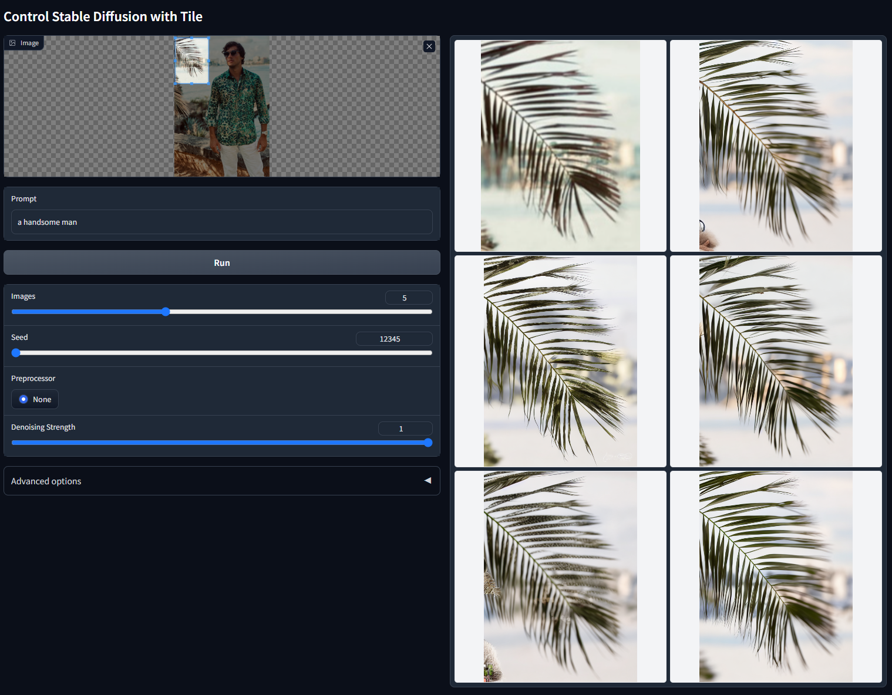

You can see that the prompt is "a handsome man" but the model does not paint "a handsome man" on that tree leaves. Instead, it recognizes the tree leaves paint accordingly.

In this way, ControlNet is able to change the behavior of any Stable Diffusion model to perform diffusion in tiles. 

**Gallery of ControlNet Tile**

*Note:* Our official support for tiled image upscaling is A1111-only. The gradio example in this repo does not include tiled upscaling scripts. Please use the A1111 extension to perform tiled upscaling (with other tiling scripts like Ultimate SD Upscale or Tiled Diffusion/VAE).

From https://github.com/Mikubill/sd-webui-controlnet/discussions/1142#discussioncomment-5788601

(Output, **Click image to see full resolution**)

(Zooming-in of outputs)

From https://github.com/Mikubill/sd-webui-controlnet/discussions/1142#discussioncomment-5788617

(Input)

(Output, **Click image to see full resolution**)

From: https://github.com/lllyasviel/ControlNet-v1-1-nightly/issues/50#issuecomment-1541914890

(Input)

(Output, **Click image to see full resolution**, note that this example is extremely challenging)

From https://github.com/Mikubill/sd-webui-controlnet/discussions/1142#discussioncomment-5796326:

(before)

(after, **Click image to see full resolution**)

**Comparison to Midjourney V5/V5.1 coming soon.**

# Annotate Your Own Data

We provide simple python scripts to process images.

[See a gradio example here](github_docs/annotator.md).
