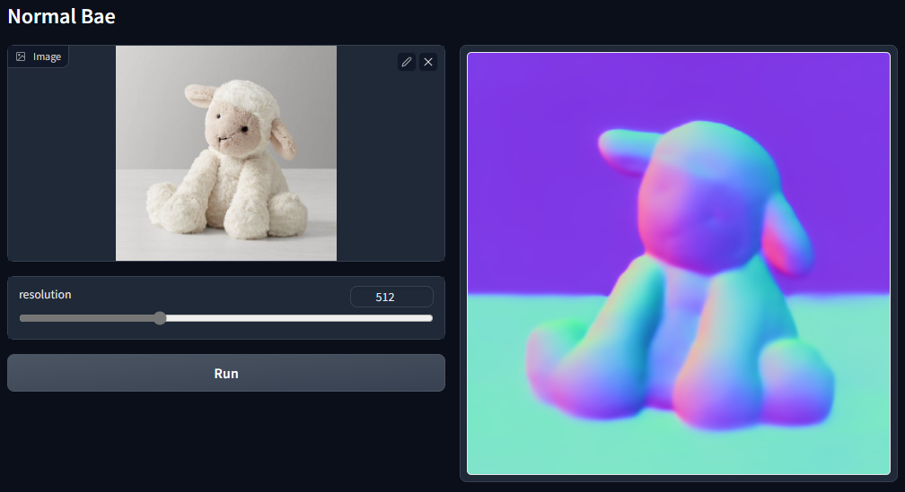
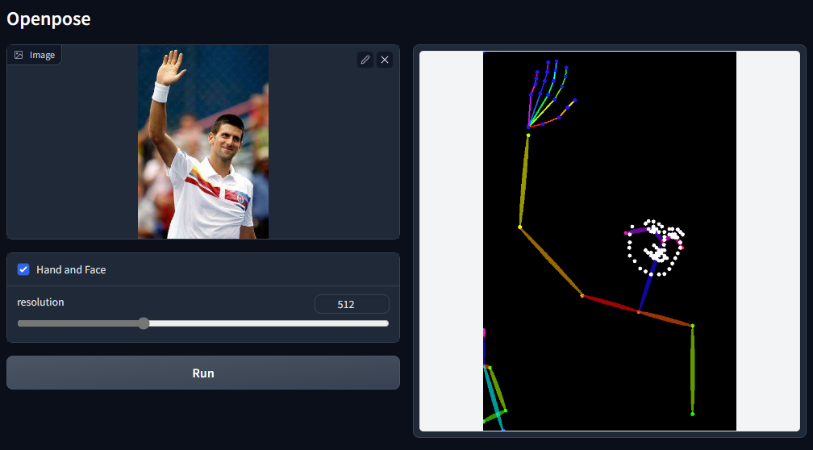
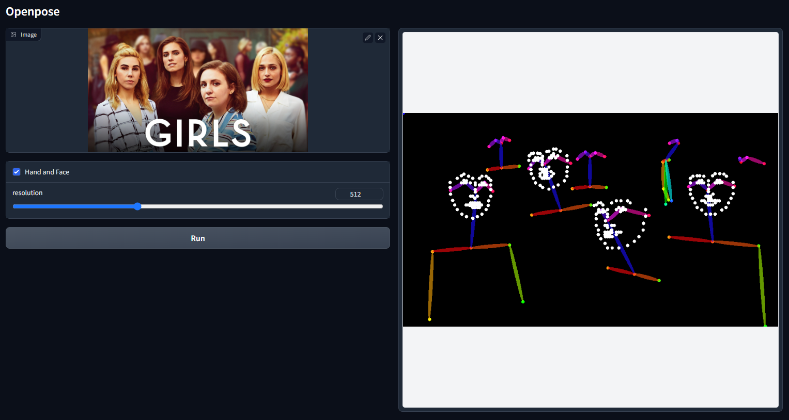
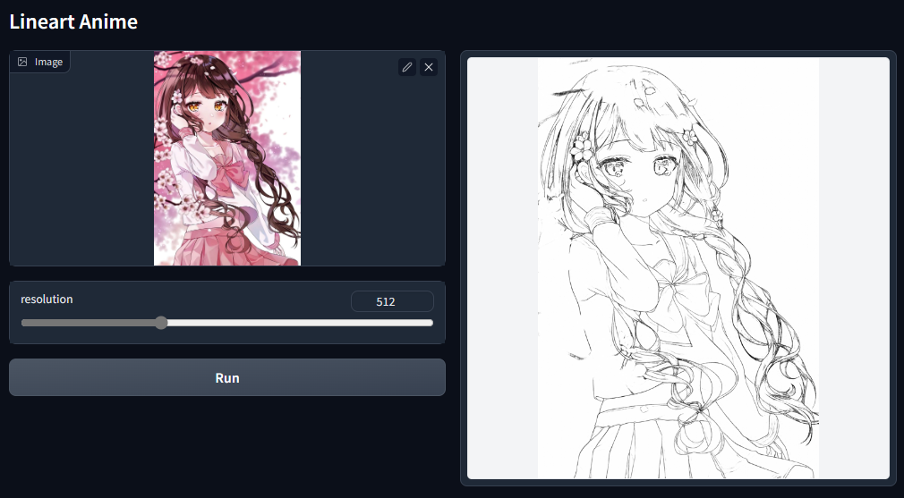
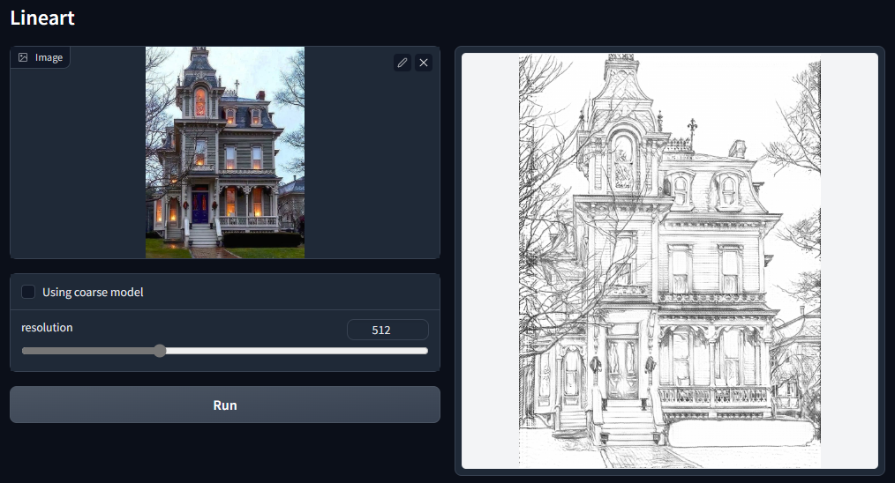
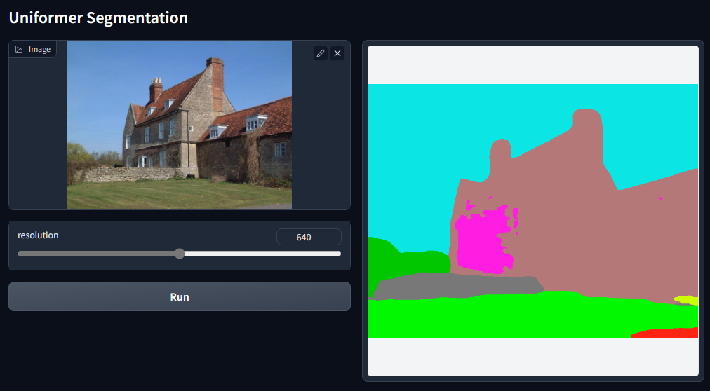

# Automatic Annotations

We provide gradio examples to obtain annotations that are aligned to our pretrained production-ready models.

Just run

    python gradio_annotator.py

Since everyone has different habit to organize their datasets, we do not hard code any scripts for batch processing. But "gradio_annotator.py" is written in a super readable way, and modifying it to annotate your images should be easy.

In the gradio UI of "gradio_annotator.py" we have the following interfaces:

# Annotators

### Canny Edge

### Soft Edge

# MLSD

The straight line detection.

# Depth

The quality of Midas is not as good as Zoe. Midas is faster and less "tricky" - Zoe uses some post-processing.

# Normal

[Bae's method](https://github.com/baegwangbin/surface_normal_uncertainty) to detect normal maps.

This method is significantly better than ControlNet 1.0's Normal-from-Midas.

Note that ControlNet 1.0's Normal-from-Midas will be abandoned, and we will move on to this annotator, and will not maintain the previous Normal-from-Midas anymore.

# Openpose

The ControlNet team made significant efforts to improve this. The differences are

(1) we fixed many bugs in previous implementation - and this implementation uses "correct" sampling methods and has better accuracy, especially for hands.

(2) Face landmarks are added.

Multiple people in the wild:

# Lineart (Anime)

This is Mukosame/Anime2Sketch.

# Lineart (Realistic)

This is awacke1/Image-to-Line-Drawings.

It turns real photo to linearts. It has two mode: the detailed mode and coarse mode.

Detailed mode:

Coarse mode:

# Semantic Segmentation

Below is the previous Uniformer in ControlNet 1.0. This model is out-of-date and will be replaced by OneFormer. Nevertheless, uniformer is still a very valid model and can be used in training as data augmentations - perhaps.

This is OneFormer. This method is SOTA. The ControlNet team made significant efforts to remove unnecessary dependencies so that anyone can use this model in nearly any environment without worrying about many difficult dependencies.

# Content Reshuffle

Use a simple random flow to reshuffle the content of an image. This can be used to train style-based ControlNets without being limited to the model scope of Clip-Vision tokenizer. 

This method was first proposed in [Two-stage Sketch Colorization](https://www.cse.cuhk.edu.hk/~ttwong/papers/colorize/colorize.html) to guide the style of image-to-image translation.

